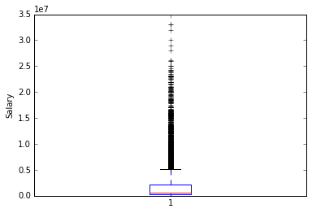

# Investigating A Baseball Dataset
## Source: 2014 Lahman's Baseball Database
## Udacity Data Analyst Nanodegree - Project 2

I used "Salaries.csv" and "AwardsSharePlayers.csv" for my project and my question to this database is 
    "What factors have an effect on team salaries?"
There are total 5 columns and I am going to analyze yearID, teamID and igID to investigate how these columns are related to salaries.

First, I am going to import these two csv files and transform to Pandas DataFrame and do some data wrangling.

```python
import matplotlib.pyplot as plt
import numpy as np
import pandas as pd

# import Salaries data
filename = 'Salaries.csv'
salariesDF = pd.read_csv(filename)

# import Players data
filename = 'AwardsSharePlayers.csv'
playersDF = pd.read_csv(filename)

salariesDF.head()
```


<div>
<table border="1" class="dataframe">
  <thead>
    <tr style="text-align: right;">
      <th></th>
      <th>yearID</th>
      <th>teamID</th>
      <th>lgID</th>
      <th>playerID</th>
      <th>salary</th>
    </tr>
  </thead>
  <tbody>
    <tr>
      <th>0</th>
      <td>1985</td>
      <td>ATL</td>
      <td>NL</td>
      <td>barkele01</td>
      <td>870000</td>
    </tr>
    <tr>
      <th>1</th>
      <td>1985</td>
      <td>ATL</td>
      <td>NL</td>
      <td>bedrost01</td>
      <td>550000</td>
    </tr>
    <tr>
      <th>2</th>
      <td>1985</td>
      <td>ATL</td>
      <td>NL</td>
      <td>benedbr01</td>
      <td>545000</td>
    </tr>
    <tr>
      <th>3</th>
      <td>1985</td>
      <td>ATL</td>
      <td>NL</td>
      <td>campri01</td>
      <td>633333</td>
    </tr>
    <tr>
      <th>4</th>
      <td>1985</td>
      <td>ATL</td>
      <td>NL</td>
      <td>ceronri01</td>
      <td>625000</td>
    </tr>
  </tbody>
</table>
</div>


```python
playersDF.head()
```


<div>
<table border="1" class="dataframe">
  <thead>
    <tr style="text-align: right;">
      <th></th>
      <th>awardID</th>
      <th>yearID</th>
      <th>lgID</th>
      <th>playerID</th>
      <th>pointsWon</th>
      <th>pointsMax</th>
      <th>votesFirst</th>
    </tr>
  </thead>
  <tbody>
    <tr>
      <th>0</th>
      <td>Cy Young</td>
      <td>1956</td>
      <td>ML</td>
      <td>fordwh01</td>
      <td>1.0</td>
      <td>16</td>
      <td>1.0</td>
    </tr>
    <tr>
      <th>1</th>
      <td>Cy Young</td>
      <td>1956</td>
      <td>ML</td>
      <td>maglisa01</td>
      <td>4.0</td>
      <td>16</td>
      <td>4.0</td>
    </tr>
    <tr>
      <th>2</th>
      <td>Cy Young</td>
      <td>1956</td>
      <td>ML</td>
      <td>newcodo01</td>
      <td>10.0</td>
      <td>16</td>
      <td>10.0</td>
    </tr>
    <tr>
      <th>3</th>
      <td>Cy Young</td>
      <td>1956</td>
      <td>ML</td>
      <td>spahnwa01</td>
      <td>1.0</td>
      <td>16</td>
      <td>1.0</td>
    </tr>
    <tr>
      <th>4</th>
      <td>Cy Young</td>
      <td>1957</td>
      <td>ML</td>
      <td>donovdi01</td>
      <td>1.0</td>
      <td>16</td>
      <td>1.0</td>
    </tr>
  </tbody>
</table>
</div>


And I am going to see if there is any null value in the data.
First salaries data.


```python
pd.isnull(salariesDF).sum()
```


    yearID      0
    teamID      0
    lgID        0
    playerID    0
    salary      0
    dtype: int64


```python
salariesDF.describe()
```


<div>
<table border="1" class="dataframe">
  <thead>
    <tr style="text-align: right;">
      <th></th>
      <th>yearID</th>
      <th>salary</th>
    </tr>
  </thead>
  <tbody>
    <tr>
      <th>count</th>
      <td>24758.000000</td>
      <td>2.475800e+04</td>
    </tr>
    <tr>
      <th>mean</th>
      <td>1999.891752</td>
      <td>1.932905e+06</td>
    </tr>
    <tr>
      <th>std</th>
      <td>8.324492</td>
      <td>3.190334e+06</td>
    </tr>
    <tr>
      <th>min</th>
      <td>1985.000000</td>
      <td>0.000000e+00</td>
    </tr>
    <tr>
      <th>25%</th>
      <td>1993.000000</td>
      <td>2.600000e+05</td>
    </tr>
    <tr>
      <th>50%</th>
      <td>2000.000000</td>
      <td>5.250000e+05</td>
    </tr>
    <tr>
      <th>75%</th>
      <td>2007.000000</td>
      <td>2.199643e+06</td>
    </tr>
    <tr>
      <th>max</th>
      <td>2014.000000</td>
      <td>3.300000e+07</td>
    </tr>
  </tbody>
</table>
</div>


Although there is no null value in the data, there are some zeros in salary column. I am going to find these rows with zero salary.


```python
salariesDF[salariesDF["salary"] == 0]
```


<div>
<table border="1" class="dataframe">
  <thead>
    <tr style="text-align: right;">
      <th></th>
      <th>yearID</th>
      <th>teamID</th>
      <th>lgID</th>
      <th>playerID</th>
      <th>salary</th>
    </tr>
  </thead>
  <tbody>
    <tr>
      <th>6179</th>
      <td>1993</td>
      <td>NYA</td>
      <td>AL</td>
      <td>jamesdi01</td>
      <td>0</td>
    </tr>
    <tr>
      <th>12007</th>
      <td>1999</td>
      <td>PIT</td>
      <td>NL</td>
      <td>martija02</td>
      <td>0</td>
    </tr>
  </tbody>
</table>
</div>


There are total two players with 0 salary. I am going to find more details about those two players.


```python
salariesDF[salariesDF["playerID"] == "jamesdi01"]
```


<div>
<table border="1" class="dataframe">
  <thead>
    <tr style="text-align: right;">
      <th></th>
      <th>yearID</th>
      <th>teamID</th>
      <th>lgID</th>
      <th>playerID</th>
      <th>salary</th>
    </tr>
  </thead>
  <tbody>
    <tr>
      <th>1302</th>
      <td>1987</td>
      <td>ATL</td>
      <td>NL</td>
      <td>jamesdi01</td>
      <td>120000</td>
    </tr>
    <tr>
      <th>1929</th>
      <td>1988</td>
      <td>ATL</td>
      <td>NL</td>
      <td>jamesdi01</td>
      <td>360000</td>
    </tr>
    <tr>
      <th>2591</th>
      <td>1989</td>
      <td>ATL</td>
      <td>NL</td>
      <td>jamesdi01</td>
      <td>400000</td>
    </tr>
    <tr>
      <th>3536</th>
      <td>1990</td>
      <td>CLE</td>
      <td>AL</td>
      <td>jamesdi01</td>
      <td>650000</td>
    </tr>
    <tr>
      <th>5293</th>
      <td>1992</td>
      <td>NYA</td>
      <td>AL</td>
      <td>jamesdi01</td>
      <td>387500</td>
    </tr>
    <tr>
      <th>6179</th>
      <td>1993</td>
      <td>NYA</td>
      <td>AL</td>
      <td>jamesdi01</td>
      <td>0</td>
    </tr>
    <tr>
      <th>8019</th>
      <td>1995</td>
      <td>NYA</td>
      <td>AL</td>
      <td>jamesdi01</td>
      <td>350000</td>
    </tr>
  </tbody>
</table>
</div>


```python
salariesDF[salariesDF["playerID"] == "martija02"]
```


<div>
<table border="1" class="dataframe">
  <thead>
    <tr style="text-align: right;">
      <th></th>
      <th>yearID</th>
      <th>teamID</th>
      <th>lgID</th>
      <th>playerID</th>
      <th>salary</th>
    </tr>
  </thead>
  <tbody>
    <tr>
      <th>11011</th>
      <td>1998</td>
      <td>PIT</td>
      <td>NL</td>
      <td>martija02</td>
      <td>170000</td>
    </tr>
    <tr>
      <th>12007</th>
      <td>1999</td>
      <td>PIT</td>
      <td>NL</td>
      <td>martija02</td>
      <td>0</td>
    </tr>
  </tbody>
</table>
</div>


Clearly for jamesdi01, the 0 value is wrong. I am going to assume the salary in 1993 as the average of 1992 and 1995. For martija02, I will ignore these two rows from the database.


```python
# Taking care of jamesdi01
salariesDF["salary"].iloc[6179] = (387500 + 350000) / 2
salariesDF[salariesDF["playerID"] == "jamesdi01"]
```


<div>
<table border="1" class="dataframe">
  <thead>
    <tr style="text-align: right;">
      <th></th>
      <th>yearID</th>
      <th>teamID</th>
      <th>lgID</th>
      <th>playerID</th>
      <th>salary</th>
    </tr>
  </thead>
  <tbody>
    <tr>
      <th>1302</th>
      <td>1987</td>
      <td>ATL</td>
      <td>NL</td>
      <td>jamesdi01</td>
      <td>120000</td>
    </tr>
    <tr>
      <th>1929</th>
      <td>1988</td>
      <td>ATL</td>
      <td>NL</td>
      <td>jamesdi01</td>
      <td>360000</td>
    </tr>
    <tr>
      <th>2591</th>
      <td>1989</td>
      <td>ATL</td>
      <td>NL</td>
      <td>jamesdi01</td>
      <td>400000</td>
    </tr>
    <tr>
      <th>3536</th>
      <td>1990</td>
      <td>CLE</td>
      <td>AL</td>
      <td>jamesdi01</td>
      <td>650000</td>
    </tr>
    <tr>
      <th>5293</th>
      <td>1992</td>
      <td>NYA</td>
      <td>AL</td>
      <td>jamesdi01</td>
      <td>387500</td>
    </tr>
    <tr>
      <th>6179</th>
      <td>1993</td>
      <td>NYA</td>
      <td>AL</td>
      <td>jamesdi01</td>
      <td>368750</td>
    </tr>
    <tr>
      <th>8019</th>
      <td>1995</td>
      <td>NYA</td>
      <td>AL</td>
      <td>jamesdi01</td>
      <td>350000</td>
    </tr>
  </tbody>
</table>
</div>


```python
# Taking care of martija02
salariesDF = salariesDF[salariesDF["playerID"] != "martija02"]
salariesDF.describe()
```


<div>
<table border="1" class="dataframe">
  <thead>
    <tr style="text-align: right;">
      <th></th>
      <th>yearID</th>
      <th>salary</th>
    </tr>
  </thead>
  <tbody>
    <tr>
      <th>count</th>
      <td>24756.000000</td>
      <td>2.475600e+04</td>
    </tr>
    <tr>
      <th>mean</th>
      <td>1999.891865</td>
      <td>1.933069e+06</td>
    </tr>
    <tr>
      <th>std</th>
      <td>8.324817</td>
      <td>3.190411e+06</td>
    </tr>
    <tr>
      <th>min</th>
      <td>1985.000000</td>
      <td>1.090000e+04</td>
    </tr>
    <tr>
      <th>25%</th>
      <td>1993.000000</td>
      <td>2.600000e+05</td>
    </tr>
    <tr>
      <th>50%</th>
      <td>2000.000000</td>
      <td>5.250000e+05</td>
    </tr>
    <tr>
      <th>75%</th>
      <td>2007.000000</td>
      <td>2.200000e+06</td>
    </tr>
    <tr>
      <th>max</th>
      <td>2014.000000</td>
      <td>3.300000e+07</td>
    </tr>
  </tbody>
</table>
</div>


Now I am going to clean the AwardsSharePlayers data.


```python
# Printout the total number of null values of each column
pd.isnull(playersDF).sum()
```


    awardID         0
    yearID          0
    lgID            0
    playerID        0
    pointsWon       0
    pointsMax       0
    votesFirst    358
    dtype: int64


```python
playersDF.describe()
```


<div>
<table border="1" class="dataframe">
  <thead>
    <tr style="text-align: right;">
      <th></th>
      <th>yearID</th>
      <th>pointsWon</th>
      <th>pointsMax</th>
      <th>votesFirst</th>
    </tr>
  </thead>
  <tbody>
    <tr>
      <th>count</th>
      <td>6705.000000</td>
      <td>6705.000000</td>
      <td>6705.000000</td>
      <td>6347.000000</td>
    </tr>
    <tr>
      <th>mean</th>
      <td>1971.344817</td>
      <td>43.168829</td>
      <td>266.107233</td>
      <td>1.612573</td>
    </tr>
    <tr>
      <th>std</th>
      <td>27.172773</td>
      <td>67.714919</td>
      <td>128.980771</td>
      <td>4.868226</td>
    </tr>
    <tr>
      <th>min</th>
      <td>1911.000000</td>
      <td>0.000000</td>
      <td>16.000000</td>
      <td>0.000000</td>
    </tr>
    <tr>
      <th>25%</th>
      <td>1950.000000</td>
      <td>4.000000</td>
      <td>140.000000</td>
      <td>0.000000</td>
    </tr>
    <tr>
      <th>50%</th>
      <td>1974.000000</td>
      <td>12.000000</td>
      <td>336.000000</td>
      <td>0.000000</td>
    </tr>
    <tr>
      <th>75%</th>
      <td>1994.000000</td>
      <td>52.000000</td>
      <td>336.000000</td>
      <td>0.000000</td>
    </tr>
    <tr>
      <th>max</th>
      <td>2014.000000</td>
      <td>448.000000</td>
      <td>448.000000</td>
      <td>32.000000</td>
    </tr>
  </tbody>
</table>
</div>


Although there are 358 null values in "votesFirst" column, I don't plan to use this column. Since other columns don't have a null value, I can leave this data as it is.

Now salary is investigated using the single-variable (1d) exploration


```python
# single-variable investigation - Salary
# plot boxplot and histogram
%matplotlib inline
plt.boxplot(salariesDF["salary"])
plt.ylabel("Salary")
plt.show()
plt.hist(salariesDF["salary"]/1000000, bins = 10)
plt.ylabel("Frequency")
plt.xlabel("Salary in millions")
plt.show()
```





In histogram, you can see that the most of the salaries are below 5 millions and very little number of people are more than 5 millions range.
However, the box plot is very difficult to understand because there are too many points and most of them seem to be outliers. In order to decrease the number of points, the set of the mean salaries per year is used to plot the boxplot.


```python
# Get a dataframe of the set of the mean salaries per year
salaryYearDF = salariesDF[["yearID","salary"]].groupby("yearID").mean()
salaryYearDF
```


<div>
<table border="1" class="dataframe">
  <thead>
    <tr style="text-align: right;">
      <th></th>
      <th>salary</th>
    </tr>
    <tr>
      <th>yearID</th>
      <th></th>
    </tr>
  </thead>
  <tbody>
    <tr>
      <th>1985</th>
      <td>476299</td>
    </tr>
    <tr>
      <th>1986</th>
      <td>417147</td>
    </tr>
    <tr>
      <th>1987</th>
      <td>434729</td>
    </tr>
    <tr>
      <th>1988</th>
      <td>453171</td>
    </tr>
    <tr>
      <th>1989</th>
      <td>506323</td>
    </tr>
    <tr>
      <th>1990</th>
      <td>511973</td>
    </tr>
    <tr>
      <th>1991</th>
      <td>894961</td>
    </tr>
    <tr>
      <th>1992</th>
      <td>1047520</td>
    </tr>
    <tr>
      <th>1993</th>
      <td>977366</td>
    </tr>
    <tr>
      <th>1994</th>
      <td>1049588</td>
    </tr>
    <tr>
      <th>1995</th>
      <td>964979</td>
    </tr>
    <tr>
      <th>1996</th>
      <td>1027909</td>
    </tr>
    <tr>
      <th>1997</th>
      <td>1218687</td>
    </tr>
    <tr>
      <th>1998</th>
      <td>1281958</td>
    </tr>
    <tr>
      <th>1999</th>
      <td>1486794</td>
    </tr>
    <tr>
      <th>2000</th>
      <td>1992984</td>
    </tr>
    <tr>
      <th>2001</th>
      <td>2279841</td>
    </tr>
    <tr>
      <th>2002</th>
      <td>2392526</td>
    </tr>
    <tr>
      <th>2003</th>
      <td>2573472</td>
    </tr>
    <tr>
      <th>2004</th>
      <td>2491776</td>
    </tr>
    <tr>
      <th>2005</th>
      <td>2633830</td>
    </tr>
    <tr>
      <th>2006</th>
      <td>2834520</td>
    </tr>
    <tr>
      <th>2007</th>
      <td>2941435</td>
    </tr>
    <tr>
      <th>2008</th>
      <td>3136517</td>
    </tr>
    <tr>
      <th>2009</th>
      <td>3277646</td>
    </tr>
    <tr>
      <th>2010</th>
      <td>3278746</td>
    </tr>
    <tr>
      <th>2011</th>
      <td>3318838</td>
    </tr>
    <tr>
      <th>2012</th>
      <td>3458421</td>
    </tr>
    <tr>
      <th>2013</th>
      <td>3723344</td>
    </tr>
    <tr>
      <th>2014</th>
      <td>3980445</td>
    </tr>
  </tbody>
</table>
</div>


Now plot the boxplot using this dataframe.


```python
# plotting box plot and histogram
%matplotlib inline
plt.boxplot(salaryYearDF.values / 1000)
plt.ylabel("Salary in thousands")
plt.show()

meanYearDF = float(salaryYearDF.mean())
medianYearDF = float(salaryYearDF.median())
print "Mean:", meanYearDF
print "Median:", medianYearDF
```


    Mean: 1902124.83333
    Median: 1739889.0
    

Mean is greater than Median as expected since the historam above shows the right skewed graph. 


Now I am going to investigate the relation between the teamID and salaries.
Find sum, max, min, mean of salaries by team ids.


```python
# Database with two columns: teamID and salary
salariesDF_reduced = salariesDF[["teamID","salary"]]

salariesDF_summary_by_teamID = salariesDF_reduced.groupby("teamID").agg([np.sum,np.max,np.min,np.mean])
salariesDF_summary_by_teamID.columns = ["sum", "max", "min", "mean"]
salariesDF_summary_by_teamID.head()
```


<div>
<table border="1" class="dataframe">
  <thead>
    <tr style="text-align: right;">
      <th></th>
      <th>sum</th>
      <th>max</th>
      <th>min</th>
      <th>mean</th>
    </tr>
    <tr>
      <th>teamID</th>
      <th></th>
      <th></th>
      <th></th>
      <th></th>
    </tr>
  </thead>
  <tbody>
    <tr>
      <th>ANA</th>
      <td>468091973</td>
      <td>13166667</td>
      <td>150000</td>
      <td>1895109</td>
    </tr>
    <tr>
      <th>ARI</th>
      <td>1209975228</td>
      <td>16000000</td>
      <td>170000</td>
      <td>2499948</td>
    </tr>
    <tr>
      <th>ATL</th>
      <td>1882946784</td>
      <td>16061802</td>
      <td>60000</td>
      <td>2184393</td>
    </tr>
    <tr>
      <th>BAL</th>
      <td>1630200038</td>
      <td>17000000</td>
      <td>60000</td>
      <td>1846206</td>
    </tr>
    <tr>
      <th>BOS</th>
      <td>2432700935</td>
      <td>22500000</td>
      <td>60000</td>
      <td>2755040</td>
    </tr>
  </tbody>
</table>
</div>


```python
def bargraph(column): # column = sum, max, min, mean
	frequency = salariesDF_summary_by_teamID[column].sort_values(axis=0, ascending = False).head(10)
	objects = frequency.index
	y_pos = np.arange(len(objects))
	plt.bar(y_pos, frequency, align='center')
	plt.xticks(y_pos, objects)
	plt.ylabel('Salary')
	plt.title("Top 10 {} of salaries by teamID".format(column))
	print "Top 10 {} of salaries by teamID".format(column)
	print frequency
	plt.show()
```


Change False to True to see the bargraphs.


```python
""" Bar graph of the number of players by teamID """
if True:
    %matplotlib inline
    bargraph("sum")
    bargraph("max")
    bargraph("min")
    bargraph("mean")

```

    Top 10 sum of salaries by teamID
    teamID
    NYA    3283488084
    BOS    2432700935
    LAN    2237766703
    PHI    1982355800
    NYN    1965737231
    ATL    1882946784
    CHN    1859833315
    SLN    1775631332
    DET    1771197687
    CHA    1699865143
    Name: sum, dtype: int64
    


    Top 10 max of salaries by teamID
    teamID
    NYA    33000000
    LAA    26187500
    LAN    26000000
    PHI    25000000
    TEX    24000000
    SEA    24000000
    NYN    23145011
    DET    23000000
    MIN    23000000
    BOS    22500000
    Name: max, dtype: int64
    


    Top 10 min of salaries by teamID
    teamID
    NYM    501560
    SFG    500500
    MIA    480000
    WAS    316000
    LAA    316000
    ARI    170000
    MIL    170000
    TBA    170000
    ANA    150000
    COL    109000
    Name: min, dtype: int64
    


    Top 10 mean of salaries by teamID
    teamID
    SFG    5315191
    LAA    4186119
    NYA    3735481
    BOS    2755040
    LAN    2505897
    ARI    2499948
    MIA    2480984
    WAS    2466758
    NYN    2345748
    NYM    2283624
    Name: mean, dtype: int64
    


### multiple-variable (2d) explorations

I believe that the player' pointsWon affects salaries. (i.e. palyers with more points have higher salaries)
So I set the pointsWon as an independent variable and salary as a dependent variable.

First, I reindex the salary dataframe with a key value set (year, player ID) so that I can join the two dataframes.


```python
# Set key value as (year, player ID) for salariesDF
keyValue = ("{}, {}".format(salariesDF["yearID"].iloc[i],salariesDF["playerID"].iloc[i]) for i in range(len(salariesDF)))

salariesDFkv = pd.DataFrame(salariesDF.values, columns = list(salariesDF.columns.values), index = list(keyValue))
salariesDFkv
```


<div>
<table border="1" class="dataframe">
  <thead>
    <tr style="text-align: right;">
      <th></th>
      <th>yearID</th>
      <th>teamID</th>
      <th>lgID</th>
      <th>playerID</th>
      <th>salary</th>
    </tr>
  </thead>
  <tbody>
    <tr>
      <th>1985, barkele01</th>
      <td>1985</td>
      <td>ATL</td>
      <td>NL</td>
      <td>barkele01</td>
      <td>870000</td>
    </tr>
    <tr>
      <th>1985, bedrost01</th>
      <td>1985</td>
      <td>ATL</td>
      <td>NL</td>
      <td>bedrost01</td>
      <td>550000</td>
    </tr>
    <tr>
      <th>1985, benedbr01</th>
      <td>1985</td>
      <td>ATL</td>
      <td>NL</td>
      <td>benedbr01</td>
      <td>545000</td>
    </tr>
    <tr>
      <th>1985, campri01</th>
      <td>1985</td>
      <td>ATL</td>
      <td>NL</td>
      <td>campri01</td>
      <td>633333</td>
    </tr>
    <tr>
      <th>1985, ceronri01</th>
      <td>1985</td>
      <td>ATL</td>
      <td>NL</td>
      <td>ceronri01</td>
      <td>625000</td>
    </tr>
    <tr>
      <th>1985, chambch01</th>
      <td>1985</td>
      <td>ATL</td>
      <td>NL</td>
      <td>chambch01</td>
      <td>800000</td>
    </tr>
    <tr>
      <th>1985, dedmoje01</th>
      <td>1985</td>
      <td>ATL</td>
      <td>NL</td>
      <td>dedmoje01</td>
      <td>150000</td>
    </tr>
    <tr>
      <th>1985, forstte01</th>
      <td>1985</td>
      <td>ATL</td>
      <td>NL</td>
      <td>forstte01</td>
      <td>483333</td>
    </tr>
    <tr>
      <th>1985, garbege01</th>
      <td>1985</td>
      <td>ATL</td>
      <td>NL</td>
      <td>garbege01</td>
      <td>772000</td>
    </tr>
    <tr>
      <th>1985, harpete01</th>
      <td>1985</td>
      <td>ATL</td>
      <td>NL</td>
      <td>harpete01</td>
      <td>250000</td>
    </tr>
    <tr>
      <th>1985, hornebo01</th>
      <td>1985</td>
      <td>ATL</td>
      <td>NL</td>
      <td>hornebo01</td>
      <td>1500000</td>
    </tr>
    <tr>
      <th>1985, hubbagl01</th>
      <td>1985</td>
      <td>ATL</td>
      <td>NL</td>
      <td>hubbagl01</td>
      <td>455000</td>
    </tr>
    <tr>
      <th>1985, mahleri01</th>
      <td>1985</td>
      <td>ATL</td>
      <td>NL</td>
      <td>mahleri01</td>
      <td>407500</td>
    </tr>
    <tr>
      <th>1985, mcmurcr01</th>
      <td>1985</td>
      <td>ATL</td>
      <td>NL</td>
      <td>mcmurcr01</td>
      <td>275000</td>
    </tr>
    <tr>
      <th>1985, mumphje01</th>
      <td>1985</td>
      <td>ATL</td>
      <td>NL</td>
      <td>mumphje01</td>
      <td>775000</td>
    </tr>
    <tr>
      <th>1985, murphda05</th>
      <td>1985</td>
      <td>ATL</td>
      <td>NL</td>
      <td>murphda05</td>
      <td>1625000</td>
    </tr>
    <tr>
      <th>1985, oberkke01</th>
      <td>1985</td>
      <td>ATL</td>
      <td>NL</td>
      <td>oberkke01</td>
      <td>616667</td>
    </tr>
    <tr>
      <th>1985, perezpa01</th>
      <td>1985</td>
      <td>ATL</td>
      <td>NL</td>
      <td>perezpa01</td>
      <td>450000</td>
    </tr>
    <tr>
      <th>1985, perryge01</th>
      <td>1985</td>
      <td>ATL</td>
      <td>NL</td>
      <td>perryge01</td>
      <td>120000</td>
    </tr>
    <tr>
      <th>1985, ramirra01</th>
      <td>1985</td>
      <td>ATL</td>
      <td>NL</td>
      <td>ramirra01</td>
      <td>750000</td>
    </tr>
    <tr>
      <th>1985, suttebr01</th>
      <td>1985</td>
      <td>ATL</td>
      <td>NL</td>
      <td>suttebr01</td>
      <td>1354167</td>
    </tr>
    <tr>
      <th>1985, washicl01</th>
      <td>1985</td>
      <td>ATL</td>
      <td>NL</td>
      <td>washicl01</td>
      <td>800000</td>
    </tr>
    <tr>
      <th>1985, boddimi01</th>
      <td>1985</td>
      <td>BAL</td>
      <td>AL</td>
      <td>boddimi01</td>
      <td>625000</td>
    </tr>
    <tr>
      <th>1985, dauerri01</th>
      <td>1985</td>
      <td>BAL</td>
      <td>AL</td>
      <td>dauerri01</td>
      <td>480000</td>
    </tr>
    <tr>
      <th>1985, davisst02</th>
      <td>1985</td>
      <td>BAL</td>
      <td>AL</td>
      <td>davisst02</td>
      <td>437500</td>
    </tr>
    <tr>
      <th>1985, dempsri01</th>
      <td>1985</td>
      <td>BAL</td>
      <td>AL</td>
      <td>dempsri01</td>
      <td>512500</td>
    </tr>
    <tr>
      <th>1985, dwyerji01</th>
      <td>1985</td>
      <td>BAL</td>
      <td>AL</td>
      <td>dwyerji01</td>
      <td>375000</td>
    </tr>
    <tr>
      <th>1985, flanami01</th>
      <td>1985</td>
      <td>BAL</td>
      <td>AL</td>
      <td>flanami01</td>
      <td>641667</td>
    </tr>
    <tr>
      <th>1985, fordda01</th>
      <td>1985</td>
      <td>BAL</td>
      <td>AL</td>
      <td>fordda01</td>
      <td>450000</td>
    </tr>
    <tr>
      <th>1985, grosswa01</th>
      <td>1985</td>
      <td>BAL</td>
      <td>AL</td>
      <td>grosswa01</td>
      <td>483333</td>
    </tr>
    <tr>
      <th>...</th>
      <td>...</td>
      <td>...</td>
      <td>...</td>
      <td>...</td>
      <td>...</td>
    </tr>
    <tr>
      <th>2014, blevije01</th>
      <td>2014</td>
      <td>WAS</td>
      <td>NL</td>
      <td>blevije01</td>
      <td>1675000</td>
    </tr>
    <tr>
      <th>2014, cedenxa01</th>
      <td>2014</td>
      <td>WAS</td>
      <td>NL</td>
      <td>cedenxa01</td>
      <td>507800</td>
    </tr>
    <tr>
      <th>2014, clippty01</th>
      <td>2014</td>
      <td>WAS</td>
      <td>NL</td>
      <td>clippty01</td>
      <td>5875000</td>
    </tr>
    <tr>
      <th>2014, desmoia01</th>
      <td>2014</td>
      <td>WAS</td>
      <td>NL</td>
      <td>desmoia01</td>
      <td>6500000</td>
    </tr>
    <tr>
      <th>2014, detwiro01</th>
      <td>2014</td>
      <td>WAS</td>
      <td>NL</td>
      <td>detwiro01</td>
      <td>3000000</td>
    </tr>
    <tr>
      <th>2014, espinda01</th>
      <td>2014</td>
      <td>WAS</td>
      <td>NL</td>
      <td>espinda01</td>
      <td>540580</td>
    </tr>
    <tr>
      <th>2014, fistedo01</th>
      <td>2014</td>
      <td>WAS</td>
      <td>NL</td>
      <td>fistedo01</td>
      <td>7200000</td>
    </tr>
    <tr>
      <th>2014, frandke01</th>
      <td>2014</td>
      <td>WAS</td>
      <td>NL</td>
      <td>frandke01</td>
      <td>900000</td>
    </tr>
    <tr>
      <th>2014, gonzagi01</th>
      <td>2014</td>
      <td>WAS</td>
      <td>NL</td>
      <td>gonzagi01</td>
      <td>8500000</td>
    </tr>
    <tr>
      <th>2014, hairssc01</th>
      <td>2014</td>
      <td>WAS</td>
      <td>NL</td>
      <td>hairssc01</td>
      <td>2500000</td>
    </tr>
    <tr>
      <th>2014, harpebr03</th>
      <td>2014</td>
      <td>WAS</td>
      <td>NL</td>
      <td>harpebr03</td>
      <td>2150000</td>
    </tr>
    <tr>
      <th>2014, jordata01</th>
      <td>2014</td>
      <td>WAS</td>
      <td>NL</td>
      <td>jordata01</td>
      <td>504300</td>
    </tr>
    <tr>
      <th>2014, koberje01</th>
      <td>2014</td>
      <td>WAS</td>
      <td>NL</td>
      <td>koberje01</td>
      <td>501000</td>
    </tr>
    <tr>
      <th>2014, larocad01</th>
      <td>2014</td>
      <td>WAS</td>
      <td>NL</td>
      <td>larocad01</td>
      <td>12000000</td>
    </tr>
    <tr>
      <th>2014, leonsa01</th>
      <td>2014</td>
      <td>WAS</td>
      <td>NL</td>
      <td>leonsa01</td>
      <td>501000</td>
    </tr>
    <tr>
      <th>2014, lobatjo01</th>
      <td>2014</td>
      <td>WAS</td>
      <td>NL</td>
      <td>lobatjo01</td>
      <td>900000</td>
    </tr>
    <tr>
      <th>2014, matthry01</th>
      <td>2014</td>
      <td>WAS</td>
      <td>NL</td>
      <td>matthry01</td>
      <td>520000</td>
    </tr>
    <tr>
      <th>2014, mclouna01</th>
      <td>2014</td>
      <td>WAS</td>
      <td>NL</td>
      <td>mclouna01</td>
      <td>5000000</td>
    </tr>
    <tr>
      <th>2014, moorety01</th>
      <td>2014</td>
      <td>WAS</td>
      <td>NL</td>
      <td>moorety01</td>
      <td>507900</td>
    </tr>
    <tr>
      <th>2014, ramoswi01</th>
      <td>2014</td>
      <td>WAS</td>
      <td>NL</td>
      <td>ramoswi01</td>
      <td>2095000</td>
    </tr>
    <tr>
      <th>2014, rendoan01</th>
      <td>2014</td>
      <td>WAS</td>
      <td>NL</td>
      <td>rendoan01</td>
      <td>1800000</td>
    </tr>
    <tr>
      <th>2014, roarkta01</th>
      <td>2014</td>
      <td>WAS</td>
      <td>NL</td>
      <td>roarkta01</td>
      <td>506100</td>
    </tr>
    <tr>
      <th>2014, soriara01</th>
      <td>2014</td>
      <td>WAS</td>
      <td>NL</td>
      <td>soriara01</td>
      <td>11000000</td>
    </tr>
    <tr>
      <th>2014, spande01</th>
      <td>2014</td>
      <td>WAS</td>
      <td>NL</td>
      <td>spande01</td>
      <td>6500000</td>
    </tr>
    <tr>
      <th>2014, stammcr01</th>
      <td>2014</td>
      <td>WAS</td>
      <td>NL</td>
      <td>stammcr01</td>
      <td>1375000</td>
    </tr>
    <tr>
      <th>2014, storedr01</th>
      <td>2014</td>
      <td>WAS</td>
      <td>NL</td>
      <td>storedr01</td>
      <td>3450000</td>
    </tr>
    <tr>
      <th>2014, strasst01</th>
      <td>2014</td>
      <td>WAS</td>
      <td>NL</td>
      <td>strasst01</td>
      <td>3975000</td>
    </tr>
    <tr>
      <th>2014, werthja01</th>
      <td>2014</td>
      <td>WAS</td>
      <td>NL</td>
      <td>werthja01</td>
      <td>20000000</td>
    </tr>
    <tr>
      <th>2014, zimmejo02</th>
      <td>2014</td>
      <td>WAS</td>
      <td>NL</td>
      <td>zimmejo02</td>
      <td>7500000</td>
    </tr>
    <tr>
      <th>2014, zimmery01</th>
      <td>2014</td>
      <td>WAS</td>
      <td>NL</td>
      <td>zimmery01</td>
      <td>14000000</td>
    </tr>
  </tbody>
</table>
<p>24756 rows × 5 columns</p>
</div>


Similarly reindex the award dataframe with the key value set.


```python
# Set key value as (year, player ID) for playersDF
keyValue = ("{}, {}".format(playersDF["yearID"].iloc[i],playersDF["playerID"].iloc[i]) for i in range(len(playersDF)))

playersDFkv = pd.DataFrame(playersDF.values, columns = list(playersDF.columns.values), index = list(keyValue))
playersDFkv.head()
```


<div>
<table border="1" class="dataframe">
  <thead>
    <tr style="text-align: right;">
      <th></th>
      <th>awardID</th>
      <th>yearID</th>
      <th>lgID</th>
      <th>playerID</th>
      <th>pointsWon</th>
      <th>pointsMax</th>
      <th>votesFirst</th>
    </tr>
  </thead>
  <tbody>
    <tr>
      <th>1956, fordwh01</th>
      <td>Cy Young</td>
      <td>1956</td>
      <td>ML</td>
      <td>fordwh01</td>
      <td>1</td>
      <td>16</td>
      <td>1</td>
    </tr>
    <tr>
      <th>1956, maglisa01</th>
      <td>Cy Young</td>
      <td>1956</td>
      <td>ML</td>
      <td>maglisa01</td>
      <td>4</td>
      <td>16</td>
      <td>4</td>
    </tr>
    <tr>
      <th>1956, newcodo01</th>
      <td>Cy Young</td>
      <td>1956</td>
      <td>ML</td>
      <td>newcodo01</td>
      <td>10</td>
      <td>16</td>
      <td>10</td>
    </tr>
    <tr>
      <th>1956, spahnwa01</th>
      <td>Cy Young</td>
      <td>1956</td>
      <td>ML</td>
      <td>spahnwa01</td>
      <td>1</td>
      <td>16</td>
      <td>1</td>
    </tr>
    <tr>
      <th>1957, donovdi01</th>
      <td>Cy Young</td>
      <td>1957</td>
      <td>ML</td>
      <td>donovdi01</td>
      <td>1</td>
      <td>16</td>
      <td>1</td>
    </tr>
  </tbody>
</table>
</div>


Create new database that joins the salary dataframe with the player dataframe.


```python
salaryPlayerDF = pd.merge(salariesDFkv, playersDFkv, how = "inner")
salaryPlayerDF.head()
```


<div>
<table border="1" class="dataframe">
  <thead>
    <tr style="text-align: right;">
      <th></th>
      <th>yearID</th>
      <th>teamID</th>
      <th>lgID</th>
      <th>playerID</th>
      <th>salary</th>
      <th>awardID</th>
      <th>pointsWon</th>
      <th>pointsMax</th>
      <th>votesFirst</th>
    </tr>
  </thead>
  <tbody>
    <tr>
      <th>0</th>
      <td>1985</td>
      <td>ATL</td>
      <td>NL</td>
      <td>murphda05</td>
      <td>1625000</td>
      <td>MVP</td>
      <td>63</td>
      <td>336</td>
      <td>0</td>
    </tr>
    <tr>
      <th>1</th>
      <td>1985</td>
      <td>BAL</td>
      <td>AL</td>
      <td>murraed02</td>
      <td>1472819</td>
      <td>MVP</td>
      <td>130</td>
      <td>392</td>
      <td>0</td>
    </tr>
    <tr>
      <th>2</th>
      <td>1985</td>
      <td>BAL</td>
      <td>AL</td>
      <td>ripkeca01</td>
      <td>800000</td>
      <td>MVP</td>
      <td>9</td>
      <td>392</td>
      <td>0</td>
    </tr>
    <tr>
      <th>3</th>
      <td>1985</td>
      <td>BOS</td>
      <td>AL</td>
      <td>boggswa01</td>
      <td>1000000</td>
      <td>MVP</td>
      <td>159</td>
      <td>392</td>
      <td>0</td>
    </tr>
    <tr>
      <th>4</th>
      <td>1985</td>
      <td>BOS</td>
      <td>AL</td>
      <td>gedmari01</td>
      <td>477500</td>
      <td>MVP</td>
      <td>1</td>
      <td>392</td>
      <td>0</td>
    </tr>
  </tbody>
</table>
</div>


I now have a merged dataframe so I can find the correlation between pointsWon and salary.
First I am going to standardize each column for pointsWon and salary.


```python
# Standardizing
def standard(sr):
    return (sr - sr.mean())/sr.std(ddof=0)

salaryPlayerDF = salaryPlayerDF[["pointsWon", "salary"]]
```


```python
# Scatter plot for awardsWon and salary
%matplotlib inline
plt.scatter(salaryPlayerDF["pointsWon"], salaryPlayerDF["salary"])
plt.show()
```


This part is for looking at the trend of the salary change whether it increases or decreases.


```python
""" data by year """
salariesDF_by_year = salariesDF[["yearID","salary"]].groupby("yearID").agg([np.sum,np.max,np.min,np.mean])
salariesDF_by_year.columns = ["sum", "max", "min", "mean"]

if True:
    %matplotlib inline
    plt.title('Sum by year')
    plt.xlabel('Year')
    plt.ylabel('Salary')
    plt.plot(salariesDF_by_year.index, salariesDF_by_year["sum"])
    plt.show()
    plt.title('Maximum by year')
    plt.xlabel('Year')
    plt.ylabel('Salary')
    plt.plot(salariesDF_by_year.index, salariesDF_by_year["max"])
    plt.show()
    plt.title('Minimum by year')
    plt.xlabel('Year')
    plt.ylabel('Salary')
    plt.plot(salariesDF_by_year.index, salariesDF_by_year["min"])
    plt.show()
    plt.title('Mean by year')
    plt.xlabel('Year')
    plt.ylabel('Salary')
    plt.plot(salariesDF_by_year.index, salariesDF_by_year["mean"])
    plt.show()
```


All of these factors increase as year gets close to 2014. But when you look at the second graph there is a peak around at 2010 and I decided to analyze that.


```python
""" Finding maximum year """
maxSalaryByYear = salariesDF_by_year["max"].argmax()
print "\nMaximum salary occurs in {}, $ {}\n".format(maxSalaryByYear, salariesDF_by_year["max"].loc[maxSalaryByYear])
```

    
    Maximum salary occurs in 2009, $ 33000000
    
    


```python
""" Find player with the maximum in 2009 """
maxDFyear = salariesDF[salariesDF["yearID"]==2009]
maxPlayer2009 = maxDFyear[maxDFyear["salary"] == salariesDF_by_year["max"].loc[maxSalaryByYear]]
maxPlayerID = maxPlayer2009["playerID"].values[0]
print maxPlayerID
print "Detailed information of the player"
print maxPlayer2009, "\n"

```

    rodrial01
    Detailed information of the player
           yearID teamID lgID   playerID    salary
    20286    2009    NYA   AL  rodrial01  33000000 
    
    


The maximum value occurs in 2009 and the team id and player id is shown above. He had the highest salary of all time.


```python
""" maximum player's yearly graph """
maxPlayerDF = salariesDF[salariesDF["playerID"] == maxPlayerID]

if True:
    %matplotlib inline
    plt.plot(maxPlayerDF["yearID"], maxPlayerDF["salary"])
    plt.title("Year data of {}".format(maxPlayerID))
    plt.show()
```


He started from very low salary and reached to the highest salary range in 2009. Although the salary goes down after 2010, he is the highest paid player.

The correlation between year and salary is calculated. The correlation will be between -1 and 1. I expect the range would be positive since there is an increase in salary as year goes to 2014.


```python
""" Relationship between year and salary """
salaryYearDF = salariesDF[["yearID","salary"]]
standardizedDF = salaryYearDF.apply(standard)

if True:
    %matplotlib inline
    plt.scatter(standardizedDF["yearID"], standardizedDF["salary"])
    plt.title("Salaries by year")
    plt.show()
```


The code above first take yearID and salary columns and standardize those two columns. And then, the mean of product of each x coordinate and y coordinate is calculated. One interesting thing to note is that although the highest paid salaries is getting increased, the minimum salaries are almost consistent.


```python
""" Calculating correlation """
correlation = (standardizedDF["yearID"] * standardizedDF["salary"]).mean()
print "Correlation between salaries and year:",correlation
```

    Correlation between salaries and year: 0.345339080873
    

As expected the correlation comes out as a positive number. There is a positive correlation between year and players' salaries.


```python
""" Relationship between year and salary """
salaryYearDF = salariesDF[["yearID","teamID","salary"]].groupby(["yearID","teamID"]).mean()

x = salaryYearDF.index.values
x = np.array(map(lambda x: int(x[0]), x))

y = salaryYearDF.values.reshape(1, len(salaryYearDF.values))[0]

x = (x - x.mean()) / x.std()
y = (y - y.mean()) / y.std()

if True:
    %matplotlib inline
    plt.scatter(x,y)
    plt.title("Means of teams by year")
    plt.show()
```


This graph is showing only the means of teams' salaries not the entire salaries of players. As you can see that the number of points have been reduced compared to the previous graph. The mean of each team is calculated by using "groupby" in pandas. Another notable difference is that the minimum salaries of each year is increasing. We might be able to expect more positive correlation. Since there will be less negative values when we calculate the mean.


```python
""" Calculating correlation """
correlation = (x * y).mean()
print "Correlation between mean salaries by team and year:", correlation

```

    Correlation between mean salaries by team and year: 0.725273264404
    


As expected, the correlation is calculated to be a positive number and is greater than the previous correlation value. So there is an obvious trend of increase in salaries.

Lastly, I decide to find the highest paid basedball team in 2014 because when you look at the scatter plot above, the highest paid team in 2014 is the highest paid of all time.


```python
""" Find the country with the maximum mean in 2014 """
salaryYearDF = pd.DataFrame((salaryYearDF.index.values), index =np.array(range(len(salaryYearDF))), columns = ["mean"])

salaryYearDFyear = salaryYearDF["mean"].map(lambda x: x[0])
salaryYearDFteam = salaryYearDF["mean"].map(lambda x: x[1])
salaryYearDFsalary = pd.DataFrame(y, index =np.array(range(len(salaryYearDF))), columns = ["mean"])

maxidxSalary2014 = salaryYearDFsalary[salaryYearDFyear == 2014].idxmax()
maxTeam2014 = salaryYearDFteam[maxidxSalary2014.values[0]]
print "Team with the maximum mean of salaries in 2014:", maxTeam2014

```

    Team with the maximum mean of salaries in 2014: SFN